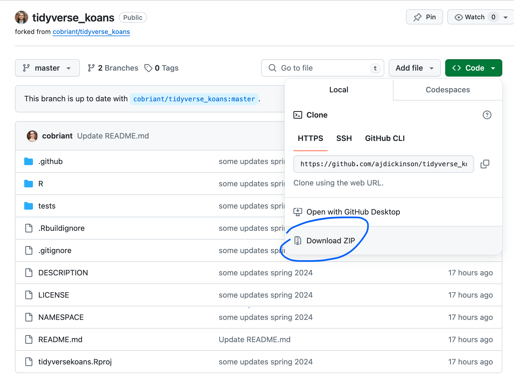

# Tidyverse Koans: A Gentle Introduction to R for Economists (and other applied researchers)

Welcome! This repository contains koans for EC320: Introduction to Econometrics at the University of Oregon, Spring 2024. It is a fork of [tidyverse_koans](https://github.com/cobriant/tidyverse_koans) repository by Colleen O'Briant. A huge thank you to Colleen for making these material public and allowing me to use them! Apart from some minor changes, all koans and the instructions below were written by her. For more information regarding the philosophy of koans, I recommend reading through Colleen's README.

# Getting Started

## 1. Install R and RStudio

First, you need to install R and RStudio. Here is a useful tutorial:

- [Install R and RStudio tutorial](https://learnr-examples.shinyapps.io/ex-setup-r/#section-welcome)

## 2. Install necessary R Packages

In R, packages are collections of functions that extend the capabilities of R. The packages we will be using in this course are part of the `tidyverse`, a collection of packages that work together to make data science in R easier. We will also be using the `gapminder` package, which contains a dataset we will use in the koans. Finally, we will be using the `gganimate` and `hexbin` packages for some special plots.

In RStudio, run these lines of code:

```r
# the tidyverse
install.packages("tidyverse", dependencies = TRUE)
library(tidyverse)

# gapminder
install.packages("gapminder")
library(gapminder)

# install some packages for special plots
install.packages("gganimate", dependencies = TRUE)
install.packages("hexbin")

# another package I developed called qelp (quick help) for beginner-friendly help docs
install.packages("Rcpp", dependencies = TRUE)
install.packages("devtools", dependencies = TRUE)
library(devtools)
install_github("cobriant/qelp")

# Run this:
?qelp::install.packages

# If everything went right, the help docs I wrote on the function `install.packages` 
# should pop up in the lower right hand pane.
```

## 3. Install the koans

On this github page, click on the green button that says "`Code`" and then hit "`Download ZIP`".



Find the file (probably in your downloads folder) and open it to unzip it. Navigate to the new folder named "`tidyverse_koans-master`" and double click on the R project "`tidyversekoans.Rproj`". RStudio should open. If it doesn't, open RStudio and go to `File > Open Project` and then find `tidyversekoans.Rproj`.

In RStudio, go to the lower righthand panel and hit the folder "`R`". This takes you to the list of 20 koans. Open the first koan: `K01_vector.R`. Before you start, modify a keybinding:

Macs: `Tools > Modify keyboard shortcuts > Run a test file > Cmd Shift T`

Windows: `Tools > Modify keyboard shortcuts > Run a test file > Ctrl Shift T`

Now hit `Cmd/Ctrl Shift T`. You've just tested the first koan. You should see:

`[ FAIL 0 | WARN 0 | SKIP 10 | PASS 0 ]`

What does this mean? If there are errors in your R script, the test will not complete. Since it completed, you know there are no errors. Since `FAIL` is 0, you also haven't failed any of the questions yet. But `PASS` is also 0, so you haven't passed the questions either. Since they're blank right now, the test will skip them. That's why `SKIP` is 10.

Go ahead and start working on the koans and learning about the tidyverse! When you're finished with a koan and the tests pass, it can be nice to be able to see your work in a compiled html document (Ctrl/Cmd Shift K or File > Compile Report).

One last thing: whenever you want to work on the koans, make sure you open RStudio by opening the "`tidyverse_koans-master`" project, not just the individual koan file. If you open the koans in a session that's not associated with the "`tidyverse_koans-master`" project, the tests will fail to run. You can always see which project your current session is being associated with by looking at the upper right hand corner of RStudio: if you're in the "`tidyverse_koans-master`" project, you'll see "`tidyverse_koans-master`" up there. That's good. If you're in no project at all, you'll see "Project: (None)" up there. That's not good, especially if you want the tests to run. If you see "Project: (None)", just click that text and you'll be able to switch over to the "`tidyverse_koans-master`" project.

